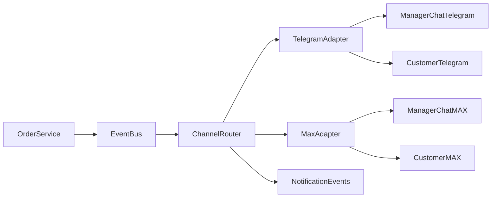

# План расширения омниканальных уведомлений под мультитенантность

Документ фиксирует целевую архитектуру и пошаговый план перевода уведомлений в мультитенантный режим для двух каналов:
- Telegram (текущий основной канал);
- MAX (новый канал в MVP-подключении).

---

## 1. Контекст и ограничения текущего состояния

Текущее состояние:
- используется один Telegram-бот агрегатора для всех ресторанов;
- часть событий и сообщений не содержит явного контекста ресторана/филиала;
- при масштабировании на несколько ресторанов растет риск путаницы в уведомлениях.

Ключевые риски:
- менеджер получает push и не понимает, из какого ресторана пришел заказ;
- пользователь получает статус заказа без однозначного указания ресторана, куда ушел заказ;
- при повторной доставке уведомлений возможны дубли без idempotency-ключа;
- сложно дебажить инциденты без канального event-log.

Обязательный контекст каждого уведомления:
- `organization_id` (`shop_id`);
- `restaurant_id` (`branch_id`);
- `city_id`;
- `channel` (`telegram` или `max`);
- `conversation_id` (chat/thread/user binding);
- `notification_key` (idempotency).

---

## 2. Требования к мультитенант-уведомлениям Telegram

### 2.1. Бизнес-правило идентификации

В каждом исходящем сообщении обязательно указывается ресторанный контекст.

Для менеджера:
- бренд;
- филиал;
- город;
- номер заказа.

Для клиента:
- ресторан, куда отправлен заказ;
- филиал/точка исполнения;
- текущий статус и ожидаемое окно исполнения (если есть).

### 2.2. Шаблоны сообщений (MVP)

#### Шаблон менеджеру (`ORDER_CREATED`)

```text
Новый заказ #{orderNumber}
Ресторан: {brandName} • {branchName} • {cityName}
Клиент: @{username} (id:{userId})
Состав: {itemsShort}
Сумма: {totalAmount} ₽
```

#### Шаблон клиенту (`ORDER_ACCEPTED`, `ORDER_IN_PROGRESS`, `ORDER_DONE`)

```text
Статус заказа #{orderNumber}: {statusLabel}
Ресторан: {brandName} • {branchName} • {cityName}
Комментарий: {optionalStatusNote}
```

### 2.3. Правила локализации

- базовая локаль MVP: `ru-RU`;
- плейсхолдеры дат/времени форматируются в часовом поясе филиала;
- все каналы используют единый словарь статусов (`statusLabel`), чтобы исключить расхождения между Telegram и MAX.

### 2.4. Получатели уведомлений в настройках ресторана

В настройках ресторана (`shop`/`restaurant`) нужно явно поддержать две модели доставки менеджерских уведомлений.

Модель A: персональные менеджеры
- в настройках хранится список привязанных менеджеров для ресторана/филиала;
- для каждого менеджера хранится канал и идентификатор доставки (`telegram_user_id`, позже `max_user_id`);
- `ChannelRouter` рассылает уведомление всем активным получателям из списка.

Модель B: общий чат менеджеров (группа)
- в настройках ресторана хранится `manager_group_chat_id` для Telegram (и аналог для MAX на следующем этапе);
- бот отправляет одно уведомление в группу, где находятся все менеджеры;
- используется как основной или fallback-режим, если персональные связи не заполнены.

Рекомендуемый приоритет в MVP:
1. Если у филиала задан `manager_group_chat_id` -> отправлять в группу.
2. Иначе отправлять по списку привязанных менеджеров.
3. Если нет ни группы, ни менеджеров -> `failed_context` + запись в `notification_events`.

Минимальные настройки в UI:
- переключатель режима: `Группа менеджеров` / `Персональные менеджеры`;
- поля привязки: список менеджеров и/или `chat_id` группы;
- кнопка тестовой отправки «Проверить уведомление» с сохранением результата в лог.

---

## 3. Контракты данных и минимальные изменения (MVP)

### 3.1. Контракт события заказа

```ts
type NotificationEvent = {
  eventId: string
  eventType: 'ORDER_CREATED' | 'ORDER_STATUS_CHANGED'
  occurredAt: string
  tenantContext: {
    shopId: string
    restaurantId: string
    cityId: string
    tenantSlug?: string
  }
  channelContext: {
    channelType: 'telegram' | 'max'
    botId?: string
    chatId?: string
    userId?: string
    conversationId?: string
  }
  orderContext: {
    orderId: string
    orderNumber: string
    totalAmount: number
    status: string
  }
  notificationKey: string
}
```

### 3.2. Лог доставки уведомлений

Минимальный лог/таблица `notification_events`:
- `id` (uuid);
- `notification_key` (unique);
- `event_type`;
- `channel`;
- `shop_id`, `restaurant_id`, `city_id`;
- `conversation_id`;
- `delivery_status` (`pending`, `sent`, `failed`, `retrying`);
- `attempt_count`;
- `last_error`;
- `created_at`, `updated_at`.

### 3.3. Идемпотентность

- ключ `notification_key` формируется детерминированно:  
  `"{eventType}:{orderId}:{channel}:{targetType}:{targetId}"`;
- при повторной обработке с тем же ключом отправка не дублируется;
- повторный вызов обновляет `attempt_count/updated_at`, но не создает новый бизнес-ивент.

---

## 4. План миграции к ChannelRouter (один бот, много ресторанов)

### 4.1. Целевая схема



### 4.2. Шаги миграции

1. Инкапсулировать текущую отправку Telegram в `TelegramChannelAdapter`.
2. Ввести `ChannelRouter` как единую точку маршрутизации по `eventType + tenantContext + channelPolicy`.
3. Добавить policy-резолвер целевых получателей:
   - менеджерские чаты по `shop_id/restaurant_id`;
   - клиентские чаты по user binding в заказе.
4. Подключить запись `notification_events` перед и после отправки.
5. Добавить retry pipeline для `failed/retrying` статусов.

### 4.3. Fallback при неполном контексте

- если отсутствует `restaurant_id` или целевой `chatId`:
  - событие помечается `failed_context`;
  - пишется подробный `last_error`;
  - событие попадает в очередь ручного разбора/повтора.

---

## 5. План интеграции MAX (MVP)

### 5.1. Подход

MAX подключается как второй канал поверх той же событийной модели, без изменения бизнес-логики заказа.

### 5.2. Контракт адаптера MAX

```ts
interface MaxChannelAdapter {
  sendToManager(event: NotificationEvent): Promise<void>
  sendToCustomer(event: NotificationEvent): Promise<void>
  handleInbound(update: unknown): Promise<void>
}
```

### 5.3. MVP-этапы подключения

1. Discovery API MAX:
   - auth-модель;
   - ограничения по rate limit;
   - формат webhook/long-poll;
   - поддерживаемые типы сообщений.
2. Модель идентификаторов:
   - хранение `max_user_id`, `max_chat_id`, `max_conversation_id`;
   - маппинг с `shop_id/restaurant_id`.
3. Исходящие системные уведомления:
   - только текстовые статусы на первом шаге;
   - интерактивные кнопки и workflow-ответы выносятся в Phase 2.
4. Delivery tracking:
   - статусы `sent/failed/retrying`;
   - backoff (например, 30s -> 2m -> 10m);
   - DLQ/failed list для ручной обработки.
5. Feature flags:
   - `channel.max.enabled` на уровне `shop`;
   - опционально override на уровне `restaurant`.

### 5.4. Fallback-стратегия

- если MAX временно недоступен:
  - событие не теряется, переводится в retry;
  - статус отражается в `notification_events`;
  - при исчерпании попыток событие остается в `failed` и доступно для ручного ретрая.

---

## 6. Статус выполнения (живой трекер)

> Обновляется после каждого завершенного шага реализации.

### 6.1. Статус

- `Done`:
  - [ ] Контракт tenant/channel context утвержден и внедрен в код.
  - [ ] Добавлен `notification_events` с idempotency.
  - [ ] Внедрен `ChannelRouter` и адаптирован Telegram.
  - [ ] Подключен `MaxChannelAdapter` (MVP отправка + retry).
- `In Progress`:
  - [ ] Заполнить по активной задаче.
- `Blocked`:
  - [ ] Нет блокеров.
- `Next`:
  - [ ] Уточнить API-поведение MAX для inbound updates.

### 6.2. Журнал изменений

| Дата | Изменение | Артефакт |
|------|-----------|----------|
| 2026-04-08 | Создан план мультитенантного омниканального роутинга и интеграции MAX | docs/OMNICHANNEL_MULTITENANT_PLAN_RU.md |

### 6.3. Открытые вопросы

1. Нужны ли интерактивные действия менеджера в MAX в рамках MVP, или только отправка статусов?
2. Требуется ли синхронный fallback на Telegram, если MAX-канал не доставил уведомление после N попыток?
3. Какой источник истины для связи manager chat с филиалом (`restaurant_id`) будет выбран в первой итерации?

---

## 7. Пошаговый execution-план

1. Зафиксировать tenant/channel контракт и шаблоны сообщений.
2. Добавить `notification_events` и idempotency.
3. Внедрить `ChannelRouter` и обязательную подпись ресторана в Telegram.
4. Протянуть tenant context через создание заказа и статусные события.
5. Подключить `MaxChannelAdapter` (MVP отправка, delivery status, retry).
6. Добавить feature flags и fallback-правила канала.
7. Вести live-обновление статуса и changelog в этом документе.

---

## 8. Критерии готовности

- В каждом уведомлении однозначно определяется ресторан-источник и ресторан-назначение.
- Канальный роутинг работает через единый `ChannelRouter` с event-log и идемпотентностью.
- MAX интегрирован на уровне MVP-контракта и операционной надежности (retry + failed tracking).
- В документации есть прозрачный статус прогресса, changelog и список открытых вопросов.
