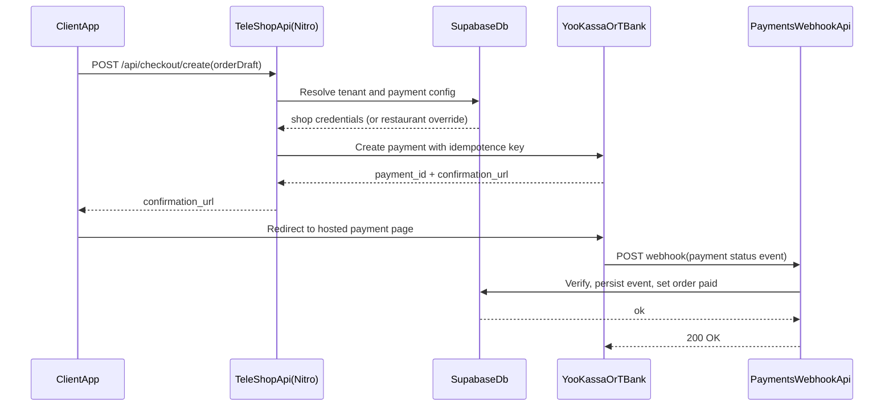
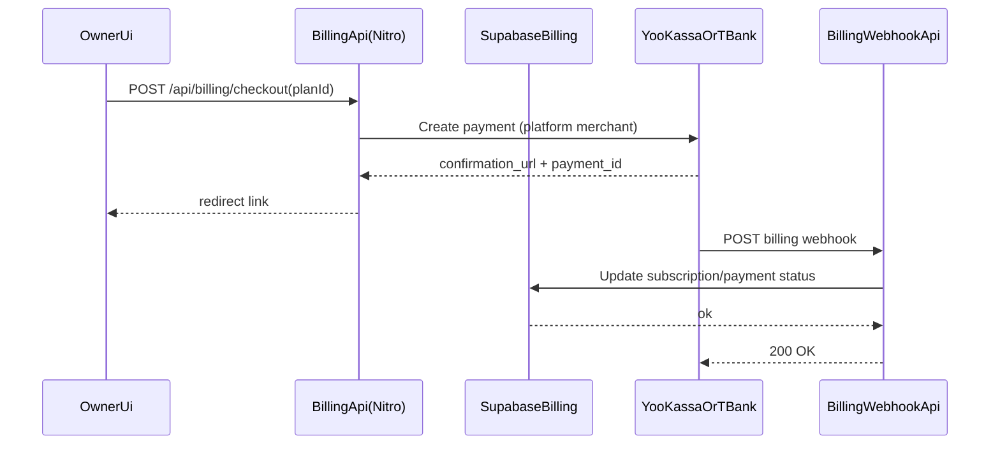

# Платежи в РФ: YooKassa и Т-Банк (архитектура TeleShop)

Документ фиксирует целевую платежную архитектуру для платформы на Nuxt 3 + Nitro + Supabase + Vercel.
Здесь описаны только процессы и контракты интеграции (без привязки к конкретной реализации SDK в коде).

---

## 1. Два независимых платежных контура

### 1.1. Контур B2C: оплата клиентских заказов

- Клиент платит за заказ ресторана.
- Деньги идут напрямую на расчетный счет ресторана через его merchant-кабинет (YooKassa или Т-Банк).
- Платформа не принимает и не удерживает эти деньги на старте.

### 1.2. Контур B2B: SaaS-подписка TeleShop

- Владелец ресторана платит за тариф платформы.
- Деньги идут на расчетный счет платформы через отдельный merchant-кабинет платформы.
- Этот контур полностью изолирован от клиентских заказов.

---

## 2. Модель хранения ключей и провайдеров

### 2.1. Решение для MVP: ключи на уровне `shop`

Для B2C в MVP хранение учетных данных эквайринга делается на уровне `shop`:

- один набор provider credentials на бренд/организацию;
- все филиалы (`restaurant`) этого `shop` используют общий merchant;
- проще запуск, меньше ошибок в операционке и онбординге.

### 2.2. Расширение: branch override на уровне `restaurant`

Нужно заранее заложить путь расширения, когда у филиалов разные договоры с банком:

- базовый источник: `shop` credentials;
- опциональный override: `restaurant` credentials;
- резолвинг при создании платежа: сначала `restaurant`, иначе fallback на `shop`;
- API и UI остаются обратносуместимыми, если fallback не убран.

Рекомендуемая схема эволюции:
1. Добавить nullable-поля/таблицу `restaurant_payment_providers`.
2. Реализовать fallback-логику чтения ключей.
3. Включить UI-переключатель "Индивидуальный эквайринг филиала".
4. После миграции данных при необходимости отключить fallback.

---

## 3. Серверная граница безопасности

- На клиенте (Vue/Nuxt pages) нет секретов, подписи формируются только на сервере.
- Все действия оплаты идут через `server/api/*`.
- Клиент получает только безопасные данные:
  - `payment_id`,
  - `confirmation_url` (или equivalent redirect token),
  - публичный статус оплаты.

Минимальные требования:
- хранить provider keys server-only;
- отдавать в UI только маскированные значения (`****1234`);
- ограничить доступ к управлению ключами ролью `Owner`.

---

## 4. Поток B2C: заказ ресторана (Create -> Redirect -> Webhook)

### 4.1. Почему `return_url` недостаточен

- Пользователь может закрыть вкладку и не вернуться в checkout.
- Надежный источник финального статуса - webhook от провайдера.
- `return_url` используется только как UX-экран (`success` / `pending` / `failed`), но не как источник истины.

### 4.2. Webhook требования

- Проверка подлинности запроса (подпись/секрет провайдера).
- Идемпотентность обработки (повторы одного события не ломают состояние).
- Хранение журнала входящих событий (`webhook_events`) с результатом валидации.
- Защита от replay-атак (временные окна, nonce/event-id, повторная валидация).

---

## 5. Поток B2B: подписка платформы

Детальная модель подписок и биллинга описана в `docs/SAAS_BILLING_RU.md`.

---

## 6. Логическая модель данных (proposal)

### 6.1. Настройки провайдера (B2C)

- `shop_payment_providers`
  - `shop_id`
  - `provider` (`yookassa` | `tbank`)
  - `merchant_shop_id`
  - `secret_key_encrypted`
  - `is_active`
  - `updated_by`
  - `updated_at`

Опционально для branch override:
- `restaurant_payment_providers`
  - `restaurant_id`
  - остальные поля аналогично

### 6.2. Платежи по заказам

- `order_payment_intents`
  - `order_id`
  - `shop_id`
  - `restaurant_id`
  - `provider`
  - `provider_payment_id`
  - `amount`
  - `currency`
  - `status` (`created` | `pending` | `succeeded` | `canceled` | `refunded`)
  - `idempotence_key`
  - `confirmation_url`
  - `created_at`

- `payment_webhook_events`
  - `provider`
  - `event_id`
  - `provider_payment_id`
  - `payload_json`
  - `is_verified`
  - `processed_at`
  - `processing_result`

### 6.3. Биллинг платформы (B2B)

- `billing_subscriptions`
  - `shop_id`
  - `plan_code`
  - `status` (`active` | `past_due` | `canceled` | `trial`)
  - `current_period_start`
  - `current_period_end`
  - `provider`
  - `provider_customer_id`
  - `provider_subscription_id`

- `billing_payments`
  - `subscription_id`
  - `provider_payment_id`
  - `amount`
  - `status`
  - `paid_at`

---

## 7. Статусы оплаты и связь со статусом заказа

Рекомендованный маппинг:

- `payment.succeeded` -> `orders.payment_status = paid`, заказ попадает в операционный поток кухни.
- `payment.pending` -> заказ в статусе ожидания оплаты, таймаут контролируется бизнес-правилом.
- `payment.canceled`/`payment.failed` -> заказ не переходит в paid, UI предлагает повторную оплату.
- `payment.refunded` -> фиксируется возврат, операционный статус заказа меняется по внутреннему регламенту.

Важно: статус оплаты хранится отдельно от статуса производства/доставки заказа.

---

## 8. Возвраты и ответственность

- Инициатор возврата: ресторан (для B2C) или платформа (для B2B).
- Платформа ведет audit trail:
  - кто инициировал,
  - когда,
  - по какому заказу/подписке,
  - сумма и причина.
- Финальное финансовое исполнение возврата - у merchant-аккаунта соответствующего контура.

---

## 9. API-контуры (документационный target)

### B2C
- `POST /api/checkout/create`
- `POST /api/webhooks/payments/:provider`
- `GET /api/checkout/status/:orderId`

### B2B
- `POST /api/billing/checkout`
- `POST /api/webhooks/billing/:provider`
- `GET /api/billing/subscription`

Маршруты выше - целевая схема именования для документации; фактический нейминг можно уточнить при реализации.

---

## 10. Staging и Production

- Для каждой среды нужны отдельные credentials провайдера и webhook URL.
- Нельзя смешивать тестовые и боевые ключи в одной среде.
- Webhook endpoints и return URLs должны соответствовать среде (`staging`/`production`).

См. также инфраструктурный документ: `docs/VERCEL_SUPABASE_TEST_PROD.md`.

---

## 11. Промокоды и бонусы (B2C-заказ)

- Итоговая сумма к оплате (**включая** скидку по промокоду и списание бонусов) рассчитывается **только на сервере** при создании заказа; клиент не является источником истины.
- Поля заказа: `subtotal` (товары после промо, до списания бонусов), `discount_amount`, `bonus_amount_spent`, `total` = товары к оплате после бонусов + доставка.
- Онлайн-оплата: `POST /api/checkout/create` передаёт в провайдера сумму `order.total`; минимальная сумма для оплаты карты на стороне платформы — **не ниже 1 ₽** (иначе заказ отклоняется при оформлении).
- После подтверждения оплаты webhook YooKassa начисляет бонусы (процент от `subtotal` по настройкам ресторана), идемпотентно.

## 12. Чеклист внедрения (documentation-ready)

- [ ] Разведены B2C и B2B merchant-аккаунты.
- [ ] Ключи B2C хранятся на `shop` уровне (MVP), описан migration-path к `restaurant`.
- [ ] Webhook обработка обязательна и идемпотентна.
- [ ] Описаны `pending/failed/canceled/refunded` сценарии.
- [ ] В интерфейсе нет операций, завязанных на клиентские секреты.
- [ ] В документации явно указано, что return URL не является источником истины.
- [ ] Зафиксированы правила промокодов/бонусов и минимальная сумма онлайн-платежа.

